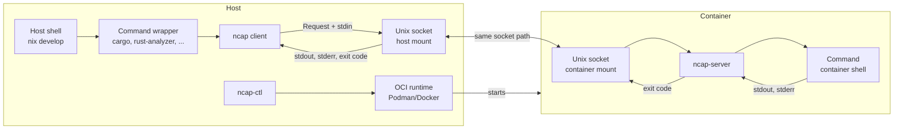

# nix-capsule

> [!WARNING]
> **Work in progress.** The v2 implementation and lifecycle tooling are still under development and are not ready for production use.

nix-capsule runs a Nix devshell inside an OCI container while you keep using your host shell. Host-side command wrappers send work to the container, and command I/O is streamed back to your terminal.

## Quick Visual Explanation

## Why It Exists

`nix develop` provides a convenient shell and good editor integration, but its tools run directly on the host. Running every command manually with `docker` or `podman` provides isolation, but loses the normal host-shell workflow.

nix-capsule aims to combine both approaches: keep the host shell, editor, and direnv workflow while executing development tools inside an OCI container.

## How It Works

nix-capsule splits the devshell into two sides:

- **Host shell:** a lightweight shell containing `ncap`, `ncap-ctl`, and generated command wrappers.
- **Container shell:** the real toolchain, evaluated on the host and loaded into the container through a cached environment dump.

Each command uses one connection over a per-project Unix socket. `ncap-server` runs inside the container, starts the requested child process, and relays stdin, stdout, stderr, exit status, and selected signals. The project root is mounted at the same absolute path on both sides, so host working directories remain valid in the container.

Current design limitations include no TTY/PTY support and Linux-only operation.

## Current Status

The current v2 work includes:

- Binary protocol framing and typed messages
- `ncap` client command execution
- `ncap-server` child-process and stream handling
- Process-group signal relay and disconnect cleanup
