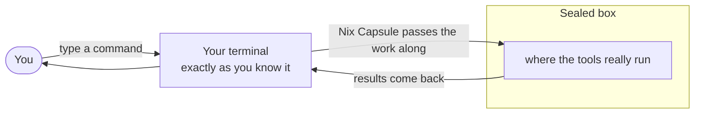

# Nix Capsule

*Run a project's building tools inside a sealed-off box on your computer — while you keep using your normal terminal, exactly as you always have.*

## What is this?

Some software projects come with their own toolbox: special programs that build, test, and check the code. Nix Capsule keeps that toolbox locked inside a container — a sealed-off compartment on your computer — so the tools can do their job without touching anything outside the project.

From your side, nothing changes. You open a terminal, type a command, press Enter. Nix Capsule quietly passes the work to the sealed box, and the result appears right back in your terminal, as if it happened on your own machine.

## The problem it solves

| Without Nix Capsule | With Nix Capsule |
| --- | --- |
| Project tools run loose on your computer and can touch your files and settings | Tools stay sealed inside the box and only see the project |
| Working safely means moving into the box yourself and leaving your usual setup behind | You stay in your usual terminal and setup — the work goes to the box |
| "Is my setup up to date?" checks are slow and heavy | Checks are quick — the toolbox is confirmed fresh without slow rebuilds |

## See it in one picture

## What makes it different

- **No new habits.** Keep your terminal, your editor, and your workflow — Nix Capsule works behind the scenes.
- **Nothing sneaks out.** Tools in the box can work on the project, but can't wander into the rest of your computer.
- **Always fresh.** A quick check confirms the toolbox is up to date before use — no waiting for slow rebuilds.
- **Feels native.** Stopping a command with Ctrl-C, error codes in scripts — everything behaves like you'd expect.
- **Safety rails included.** Sensitive files are read-only where it matters, and extra locks are available when you want them.
